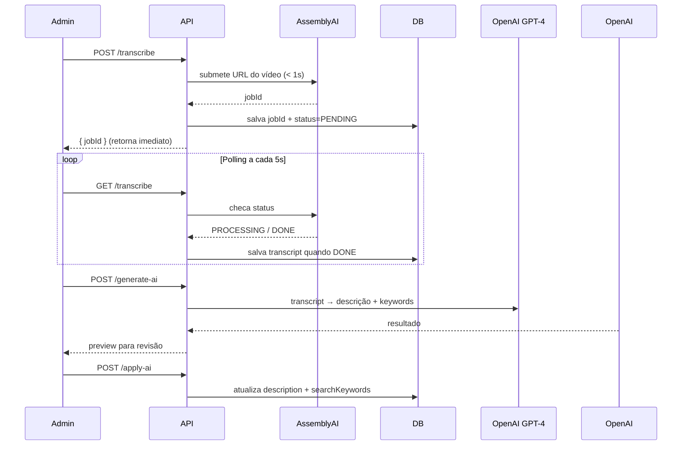

# Plan: Transcrição + IA para Aulas

**TL;DR** — A sua abordagem faz sentido, mas pode ser muito mais eficiente. O maior problema é o timeout do **Vercel Free (10s)** — qualquer tentativa de fazer download + ffmpeg + transcrever em uma única request vai falhar para vídeos médios/longos. A solução é usar um serviço de transcrição **assíncrono com polling**, e o melhor candidato gratuito é o **AssemblyAI** (5h/mês free, aceita URL HLS do Bunny diretamente, sem download, sem ffmpeg).

---

### Por que NÃO fazer download do vídeo?

| Problema | Impacto |
|---|---|
| Vercel Free timeout = **10s** | Download + ffmpeg + Whisper = 60-300s |
| ffmpeg binário em serverless | Funciona local, falha em produção Vercel |
| Vídeos 1-5GB | Memória esgotada |

### Abordagem recomendada

**AssemblyAI** (transcrição) + **OpenAI GPT-4** (descrição + keywords)
- AssemblyAI recebe a URL HLS do Bunny (`playlist.m3u8`) **diretamente** — você não precisa baixar nem converter nada
- Processamento é assíncrono; você salva o `jobId` e faz polling
- Cada chamada individual fica < 3s → compatível com Vercel Free

---

### Fluxo completo

---

### Steps

**Fase 1 — Schema + Migração**
1. Adicionar ao modelo `Lesson` no `prisma/schema.prisma`:
   - `transcription String?` — texto completo
   - `transcriptionStatus String?` — `PENDING | PROCESSING | DONE | FAILED`
   - `transcriptionJobId String?` — ID do job AssemblyAI
   - `aiDescription String?` — descrição gerada, aguardando aprovação
   - `aiKeywords String?` — keywords geradas, aguardando aprovação
2. Rodar `prisma migrate dev --name add-transcription-fields`

**Fase 2 — API Routes** *(paralelas entre si, dependem da Fase 1)*

3. `POST /api/admin/aulas/[id]/transcribe` — Pega `videoPlaybackUrl` da aula, submete ao AssemblyAI, salva `jobId` + `status=PENDING`, retorna em < 2s
4. `GET /api/admin/aulas/[id]/transcribe` — Verifica status no AssemblyAI; se `DONE`, salva transcript no DB
5. `POST /api/admin/aulas/[id]/generate-ai` — Lê transcript do DB, envia ao GPT-4 com prompt específico, retorna descrição + keywords (sem salvar ainda)
6. `POST /api/admin/aulas/[id]/apply-ai` — Recebe `{description?, keywords?}` aprovados e atualiza a Lesson

**Fase 3 — UI** *(depende da Fase 2)*

7. Adicionar seção "Transcrição & IA" no painel expandido de cada aula em `src/app/(admin)/admin/aulas/page.tsx`:
   - Botão **"Transcrever Áudio"** + badge de status (PENDING / PROCESSING / DONE / FAILED)
   - Quando DONE: textarea read-only com o transcript
   - Botão **"Gerar Descrição & Keywords"** (habilitado somente quando DONE)
   - Cards de preview com os resultados da IA e botões **"Aplicar"** / **"Descartar"** para cada campo

---

### Relevant files

- `prisma/schema.prisma` — adicionar 5 campos ao modelo `Lesson`
- `src/lib/bunny.ts` — reusar para gerar signed URL se necessário
- `src/app/api/admin/aulas/[id]/route.ts` — padrão de autenticação a reusar
- `src/app/(admin)/admin/aulas/page.tsx` — UI principal

### Libs a instalar

- `assemblyai` — SDK oficial, gratuito 5h/mês
- `openai` — GPT-4 para descrição + keywords (não está no package.json ainda)

*(Nota: `ffmpeg-static` já está no projeto como devDependency — não será necessário)*

---

### Verification

1. `prisma studio` confirma os novos campos na tabela `Lesson`
2. POST `/transcribe` retorna `{ jobId }` em < 2s sem timeout
3. GET `/transcribe` retorna status atualizado e persiste transcript no DB
4. POST `/generate-ai` retorna descrição coerente + lista de keywords em PT-BR
5. POST `/apply-ai` atualiza `description` e `searchKeywords` na aula
6. Ciclo completo na UI: Transcrever → aguardar → ver transcript → gerar → revisar → aplicar

---

### Decisions

- **Excluído**: download do vídeo, ffmpeg, processamento síncrono
- **Excluído**: busca full-text por transcript (pode ser fase futura)
- **Incluído**: armazenamento do transcript no DB para reuso futuro

### Further Considerations

1. **URL do Bunny acessível?** Se o CDN tiver Token Auth ativo (`BUNNY_TOKEN_AUTH_KEY`), precisamos gerar uma signed URL antes de enviar ao AssemblyAI. O plano já prevê isso.
2. **Upgrade Vercel Pro**: a Fase 2 step 5 (GPT-4) pode ficar no limite de 10s para transcritos longos. Se vier a ser problema, mover esse call para streaming SSE ou considerar Pro.
3. **Idioma**: AssemblyAI detecta PT-BR automaticamente. O prompt GPT precisa ser em português — isso será especificado na implementação.
